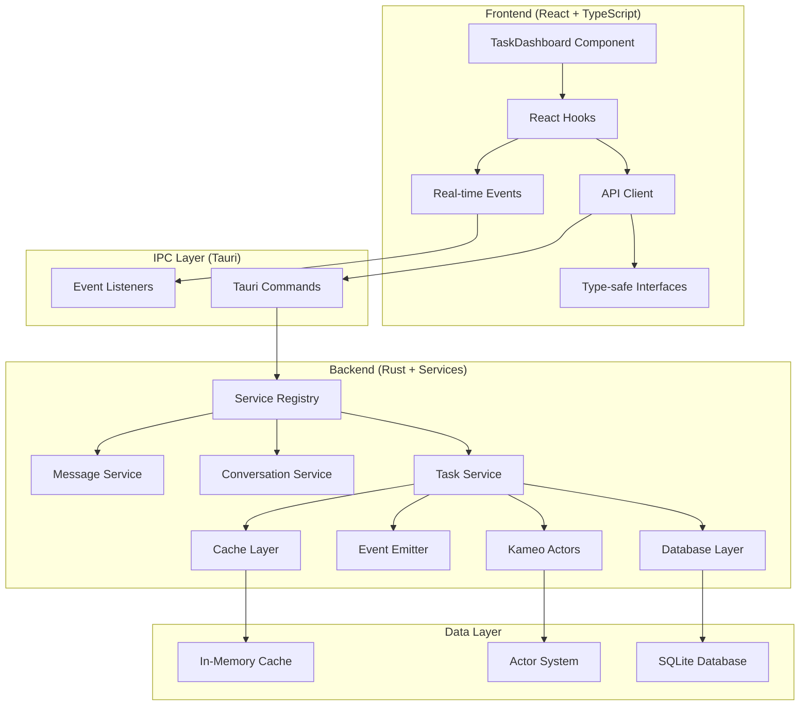

r# 🚀 Evo Design IPC & Service Framework Guide

This guide covers the elegant IPC binding/API framework for React and the sophisticated Rust service layer with Kameo actor integration.

## 📋 Table of Contents

1. [Frontend IPC Framework](#frontend-ipc-framework)
2. [Backend Service Framework](#backend-service-framework)
3. [Usage Examples](#usage-examples)
4. [Architecture Overview](#architecture-overview)
5. [Best Practices](#best-practices)

---

## 🎯 Frontend IPC Framework

### Overview

The frontend framework provides a type-safe, elegant way to communicate between your React app and the Tauri backend. It includes:

- **Type-safe API client** with auto-generated TypeScript types
- **React hooks** for state management with loading/error handling
- **Real-time event system** for live updates
- **Caching support** for optimal performance
- **Comprehensive error handling**

### Key Components

#### 1. Type Definitions (`src/lib/api/types.ts`)

```typescript
// Strongly typed entities that mirror Rust structs
export interface Task {
  id: Uuid;
  title: string;
  status: TaskStatus;
  priority: TaskPriority;
  // ... full type safety
}

export enum TaskStatus {
  Pending = "Pending",
  InProgress = "InProgress",
  Completed = "Completed",
  Failed = "Failed"
}
```

#### 2. API Client (`src/lib/api/client.ts`)

```typescript
// Organized service-based API client
export class ApiClient {
  public readonly tasks = new TaskApi();
  public readonly conversations = new ConversationApi();
  public readonly plans = new PlanApi();
  // ... other services
}

// Singleton instance ready to use
export const apiClient = new ApiClient();
```

#### 3. React Hooks (`src/lib/api/hooks.ts`)

```typescript
// Powerful hooks with loading states and error handling
export function useTasks(filter?: TaskFilter) {
  // Returns: { data, loading, error, refetch, hasMore, loadMore }
}

export function useCreateTask(options?: { onSuccess?: (task: Task) => void }) {
  // Returns: { mutate, loading, error, data, reset }
}
```

### Usage Examples

#### Basic Task Management

```typescript
import { useTasks, useCreateTask, useUpdateTaskStatus } from '../lib/api';

function TaskList() {
  // Fetch tasks with automatic loading states
  const { data: tasks, loading, error, refetch } = useTasks();
  
  // Create task mutation
  const { mutate: createTask } = useCreateTask({
    onSuccess: () => refetch() // Refresh list after creation
  });
  
  // Update task status
  const { mutate: updateStatus } = useUpdateTaskStatus();

  const handleCreateTask = async () => {
    await createTask({
      title: "New Task",
      priority: TaskPriority.High,
      // ... other fields with full type safety
    });
  };

  if (loading) return <LoadingSpinner />;
  if (error) return <ErrorMessage error={error} />;

  return (
    <div>
      {tasks?.map(task => (
        <TaskCard
          key={task.id}
          task={task}
          onStatusChange={(id, status) => updateStatus({ id, status })}
        />
      ))}
    </div>
  );
}
```

#### Real-time Updates

```typescript
import { useTaskEvents, useMessageEvents } from '../lib/api';

function RealTimeTaskBoard() {
  const { data: tasks, refetch } = useTasks();

  // Listen for real-time task updates
  useTaskEvents((event) => {
    if (event.type === 'task_updated') {
      refetch(); // Refresh the task list
    }
  });

  // Handle multiple event types
  useMessageEvents((event) => {
    switch (event.type) {
      case 'message_created':
        // Handle new message
        break;
      case 'message_updated':
        // Handle message update
        break;
    }
  });
}
```

#### Comprehensive Dashboard

```typescript
// See src/components/TaskDashboard.tsx for a full example
import { TaskDashboard } from './components/TaskDashboard';

function App() {
  return <TaskDashboard />; // Complete task management UI
}
```

---

## ⚙️ Backend Service Framework

### Overview

The backend framework provides a sophisticated service layer that integrates with:

- **Kameo actors** for concurrent processing
- **Database entities** with runtime SQLx queries  
- **Event system** for real-time updates
- **Caching layer** for performance
- **Validation system** with comprehensive error handling
- **Transaction management**

### Key Components

#### 1. Service Traits (`src-tauri/src/services/traits.rs`)

```rust
// Base service trait with CRUD operations
#[async_trait]
pub trait Service<T, CreateInput, UpdateInput, Filter> {
    async fn create(&self, ctx: &ServiceContext, input: CreateInput) -> Result<ServiceResult<T>>;
    async fn get(&self, ctx: &ServiceContext, id: Uuid) -> Result<ServiceResult<Option<T>>>;
    async fn update(&self, ctx: &ServiceContext, entity: UpdateInput) -> Result<ServiceResult<T>>;
    async fn delete(&self, ctx: &ServiceContext, id: Uuid) -> Result<ServiceResult<()>>;
    async fn list(&self, ctx: &ServiceContext, filter: Filter) -> Result<ServiceResult<Vec<T>>>;
}

// Real-time event support
#[async_trait]
pub trait EventEmitter {
    async fn emit_event(&self, ctx: &ServiceContext, event: ServiceEvent) -> Result<()>;
}

// Kameo actor integration
#[async_trait]
pub trait ActorIntegrated {
    async fn ask_actor<M, R>(&self, ctx: &ServiceContext, message: M) -> Result<R>;
    async fn tell_actor<M>(&self, ctx: &ServiceContext, message: M) -> Result<()>;
}
```

#### 2. Service Context (`src-tauri/src/services/traits.rs`)

```rust
// Rich context passed to all service operations
#[derive(Clone)]
pub struct ServiceContext {
    pub db: Pool<Sqlite>,
    pub actor_system: Arc<ActorSystem>,
    pub auth_context: Option<AuthContext>,
    pub request_id: Uuid,
    pub workspace_id: Option<Uuid>,
}

// Authentication and authorization
#[derive(Clone, Debug)]
pub struct AuthContext {
    pub user_id: Option<Uuid>,
    pub agent_id: Option<Uuid>,
    pub participant_id: Uuid,
    pub workspace_id: Uuid,
    pub roles: Vec<String>,
    pub permissions: Vec<String>,
}
```

#### 3. Service Implementation Example (`src-tauri/src/services/task.rs`)

```rust
#[derive(Clone)]
pub struct TaskService {
    base: BaseService,
}

impl TaskService {
    pub async fn create_impl(&self, ctx: &ServiceContext, input: CreateTaskInput) -> Result<ServiceResult<Task>> {
        let mut metrics = ServiceMetrics::new();

        // 1. Validate input
        self.validate_create_input(&input)?;

        // 2. Create task entity
        let task = Task {
            id: Uuid::new_v4(),
            title: input.title,
            status: TaskStatus::Pending,
            // ... other fields
        };

        // 3. Save to database
        Task::create(&self.base.db, &task).await?;

        // 4. Emit real-time event
        if let Some(emitter) = &self.base.event_emitter {
            emitter.emit(ServiceEvent {
                event_type: "task_created".to_string(),
                entity_id: task.id,
                data: serde_json::to_value(&task)?,
            }).await?;
        }

        // 5. Notify Kameo actors
        self.notify_task_created(ctx, &task, &mut metrics).await?;

        Ok(metrics.finish(task))
    }

    async fn notify_task_created(&self, ctx: &ServiceContext, task: &Task, metrics: &mut ServiceMetrics) -> Result<()> {
        // Send message to relevant actors
        let message = TaskCreatedMessage { task: task.clone() };
        // self.ask_actor(ctx, message).await?;
        
        metrics.add_interaction("TaskActor".to_string(), "task_created".to_string(), 45, true);
        Ok(())
    }
}
```

#### 4. Service Registry (`src-tauri/src/services/core.rs`)

```rust
// Centralized service management
#[derive(Clone)]
pub struct ServiceRegistry {
    pub task_service: Arc<dyn TaskServiceTrait>,
    pub conversation_service: Arc<dyn ConversationServiceTrait>,
    pub message_service: Arc<dyn MessageServiceTrait>,
    pub plan_service: Arc<dyn PlanServiceTrait>,
    pub agent_service: Arc<dyn AgentServiceTrait>,
}

// Factory for easy setup
impl ServiceFactory {
    pub fn create_registry(db: Pool<Sqlite>, enable_cache: bool, enable_events: bool) -> ServiceRegistry {
        // Automatic service initialization with optional features
    }
}
```

### Usage Examples

#### Tauri Commands (`src-tauri/src/commands/api.rs`)

```rust
#[tauri::command]
pub async fn create_task(
    input: CreateTaskInput,
    workspace_id: Option<String>,
    user_id: Option<String>,
    app_state: State<'_, AppState>,
) -> Result<ApiResponse<Task>> {
    let ctx = create_service_context(&app_state, workspace_uuid, user_uuid);
    
    match app_state.services.task_service.create(&ctx, input).await {
        Ok(result) => Ok(ApiResponse::success(result.data)),
        Err(e) => Ok(ApiResponse::error(e.to_string())),
    }
}
```

#### Application Initialization (`src-tauri/src/lib.rs`)

```rust
#[tokio::main]
pub async fn run() {
    // Initialize database
    let db = DatabaseManager::new("sqlite://./data.db")?;
    
    // Create service registry
    let services = ServiceFactory::create_registry(
        db.pool.clone(),
        true,  // enable cache
        true,  // enable events
    );
    
    // Setup Tauri with service state
    tauri::Builder::default()
        .manage(AppState { services, db })
        .invoke_handler(tauri::generate_handler![
            create_task,
            get_task,
            list_tasks,
            // ... all service commands
        ])
        .run(tauri::generate_context!())?;
}
```

---

## 📐 Architecture Overview



### Key Benefits

1. **Type Safety**: Full TypeScript→Rust type consistency
2. **Performance**: Caching, efficient database queries, actor concurrency
3. **Real-time**: Event-driven updates across the entire stack
4. **Scalability**: Modular services, actor-based processing
5. **Developer Experience**: Elegant APIs, comprehensive error handling
6. **Maintainability**: Clear separation of concerns, organized structure

---

## 🎯 Best Practices

### Frontend Best Practices

1. **Use TypeScript Strictly**
   ```typescript
   // Good: Strict typing
   const { data: tasks } = useTasks({ status: TaskStatus.Pending });
   
   // Bad: Any types
   const { data: tasks } = useTasks({ status: "pending" as any });
   ```

2. **Handle Loading States**
   ```typescript
   function TaskList() {
     const { data, loading, error } = useTasks();
     
     if (loading) return <LoadingSpinner />;
     if (error) return <ErrorDisplay error={error} />;
     
     return <TaskGrid tasks={data} />;
   }
   ```

3. **Optimize Re-renders**
   ```typescript
   // Use callbacks to prevent unnecessary re-renders
   const handleStatusChange = useCallback((id: Uuid, status: TaskStatus) => {
     updateStatus({ id, status });
   }, [updateStatus]);
   ```

### Backend Best Practices

1. **Use Service Context**
   ```rust
   // Always pass context for auth, workspace, and tracing
   pub async fn create_task(&self, ctx: &ServiceContext, input: CreateTaskInput) -> Result<ServiceResult<Task>> {
       // Validate permissions using ctx.auth_context
       // Log operations using ctx.request_id
   }
   ```

2. **Implement Proper Error Handling**
   ```rust
   // Convert database errors to app errors
   Task::create(&self.db, &task).await
       .map_err(|e| AppError::DatabaseError(e.to_string()))?;
   ```

3. **Use Metrics and Events**
   ```rust
   // Track performance and emit events
   let mut metrics = ServiceMetrics::new();
   
   // ... do work ...
   
   self.emit_event(ctx, ServiceEvent {
       event_type: "task_created".to_string(),
       entity_id: task.id,
       data: serde_json::to_value(&task)?,
   }).await?;
   
   Ok(metrics.finish(task))
   ```

4. **Leverage Actor Integration**
   ```rust
   // Use actors for background processing
   async fn notify_task_created(&self, ctx: &ServiceContext, task: &Task) -> Result<()> {
       let message = TaskCreatedMessage { task: task.clone() };
       self.tell_actor(ctx, message).await?;
       Ok(())
   }
   ```

---

## 🚀 Getting Started

1. **Initialize the backend service layer** (already done in `lib.rs`)
2. **Import the frontend API** in your React components:
   ```typescript
   import { useTasks, useCreateTask, TaskStatus } from '../lib/api';
   ```
3. **Use the TaskDashboard component** as a reference implementation
4. **Extend with additional services** following the established patterns

This framework provides a solid foundation for building sophisticated, type-safe, real-time applications with React and Tauri! 🎉 